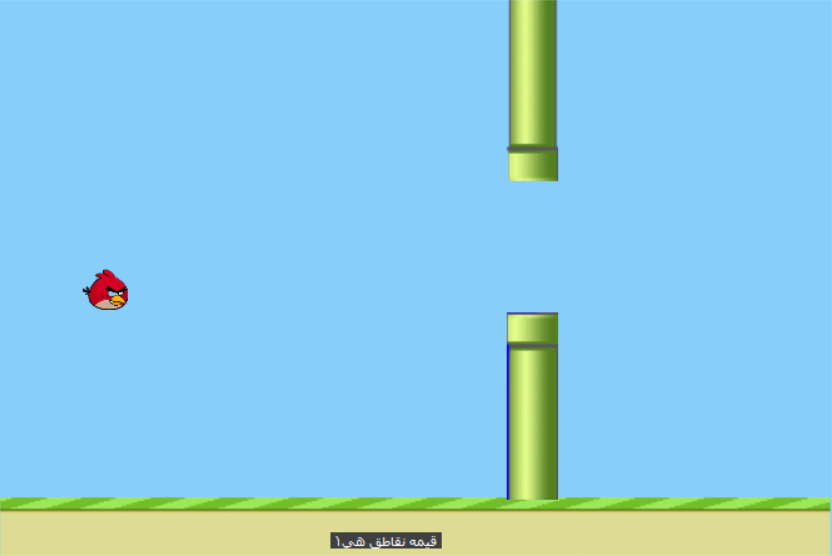

Flappy Bird game design using C# language with all the details and
distinctive movements in the game with loss mode and
points calculation mode for each major stage
with an increase in speed with each
progress in points during the game

  

How to use:

1- Open the program located in the bin folder, then press Enter to start playing.

2- To move the bird up or down, press the space bar each time you want to move it up.

All rights reserved to:

Telegram: https://t.me/Stakyws

Instagrame: @stakyus1

Whatsapp: +967780721071
